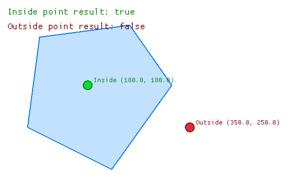
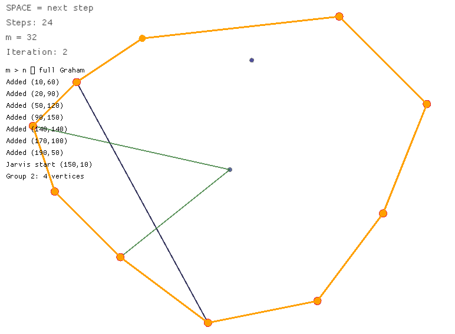

# Лабораторные работы по предмету "Вычислительная геометрия и анализ временных рядов" (Магистратура 1 курс)

# Анализ временных рядов

## Лабораторная работа №1: Дискретное преобразование Фурье (ДПФ)

**Цель:**
Изучить дискретное преобразование Фурье, научиться получать частотный спектр сигнала, определять амплитуды гармоник и восстанавливать сигнал без потерь.

**Что делается:**
- Генерируется сигнал – сумма двух синусоид (10 Гц и 25 Гц).
- Реализовано прямое и обратное ДПФ (наивный алгоритм O(N²)).
- Вычисляется амплитудный спектр, находятся пики, соответствующие частотам.
- Выполняется обратное преобразование, оценивается точность восстановления (MSE ~ 10⁻²⁹).

---

## Лабораторная работа №2: Интерполяция сигнала. Теорема Котельникова

**Цель:**
Проверить теорему Котельникова (Найквиста–Шеннона) на практике – показать, что при недостаточной частоте дискретизации восстановление сигнала невозможно, а при достаточной – возможно с высокой точностью.

**Что делается:**
- Создаётся эталонный сигнал (сумма синусоид с частотами 5, 15 и 20 Гц).
- Берутся отсчёты с частотой дискретизации выше и ниже частоты Найквиста (40 Гц).
- Сигнал восстанавливается двумя методами: идеальная sinc-интерполяция и линейная интерполяция.
- Вычисляется ошибка (MSE, RMSE в процентах) для каждого случая.

---
## Лабораторная работа №3: Вейвлеты и чирплеты

**Цель:**
Познакомиться с вейвлет-анализом как альтернативой преобразованию Фурье для нестационарных сигналов. Продемонстрировать способность чирплетов адаптироваться к сигналам с переменной частотой.

**Что делается:**
- **Часть 1:** Реализуется прямое и обратное вейвлет-преобразование Хаара. Сигнал [1,1,1,1,0,0,0,0] разлагается на уровни аппроксимации и детализации, а затем восстанавливается без потерь (MSE ~ 10⁻³²).

- **Часть 2:** Генерируется чирп-сигнал с частотой, линейно меняющейся от 5 до 20 Гц за 4 секунды. Запускается чирплет-преобразование с набором масштабов, сдвигов и параметров изменения частоты (beta). Находится комбинация параметров, дающая максимальный коэффициент корреляции.

---

# Вычислительная геометрия

## Лабораторная работа №1: Алгоритм Ray Casting (определение принадлежности точки полигону)

**Цель:**
Изучить метод Ray Casting (трассировка луча) для решения задачи «точка в полигоне»; реализовать алгоритм и визуализировать его работу.

**Что делается:**
- Задаётся произвольный простой многоугольник (пятиугольник) и две тестовые точки (заведомо внутри и снаружи).
- Реализуется алгоритм Ray Casting: из точки пускается горизонтальный луч вправо, подсчитывается число пересечений с рёбрами полигона – нечётное число означает, что точка внутри.
- С помощью библиотеки `macroquad` рисуется полигон с заливкой, контуром, а также отображаются тестовые точки с подписями результата (Inside / Outside).
- Встроены модульные тесты, проверяющие корректность работы на эталонных точках.

**Демонстрация:**  

---

## Лабораторная работа №2: Алгоритм Чена (Chan's Algorithm) для построения выпуклой оболочки

**Цель:**
Изучить алгоритм Чена – эффективный метод построения выпуклой оболочки множества точек с временной сложностью O(n log h); реализовать его с пошаговой визуализацией.

**Что делается:**
- Задаётся набор из 12 точек с произвольными координатами.
- Реализуются вспомогательные алгоритмы: Graham scan (для построения оболочек групп) и Jarvis march (для сшивания оболочек).
- Алгоритм Чена работает итеративно: 
  - на каждой итерации точки разбиваются на группы по m штук;
  - для каждой группы строится выпуклая оболочка алгоритмом Грэма;
  - затем оболочки «сшиваются» алгоритмом Джарвиса с ограничением числа шагов m;
  - если за m шагов оболочка не замкнулась, m увеличивается в 4 раза и процесс повторяется;
  - если m превышает общее число точек, выполняется полный Graham scan.
- Реализована пошаговая визуализация в окне `macroquad`: отображаются группы, оболочки групп, текущий прогресс Джарвиса и финальная оболочка.
- На каждом шаге выводится информационное сообщение (лог).

**Демонстрация:**  
